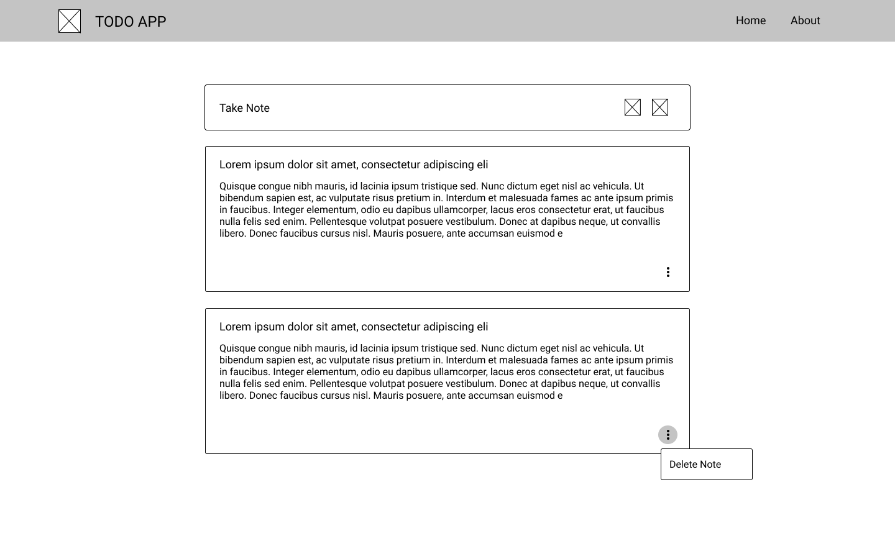
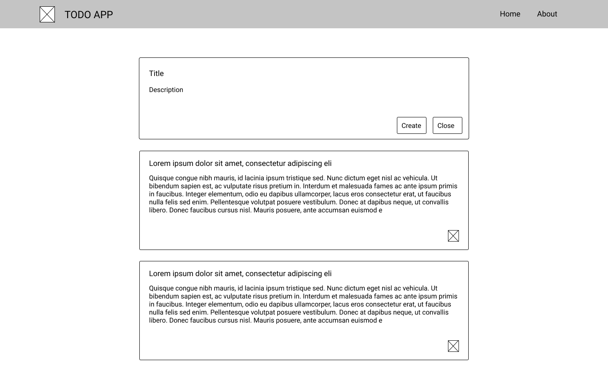
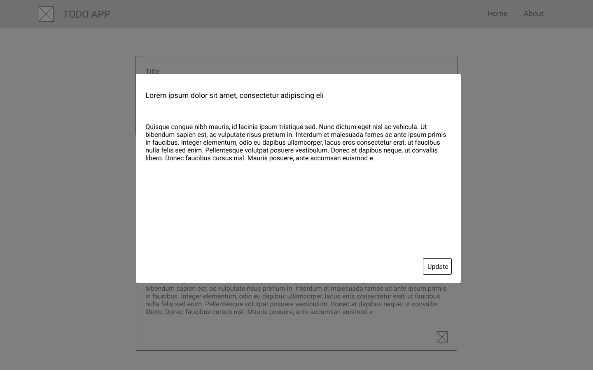
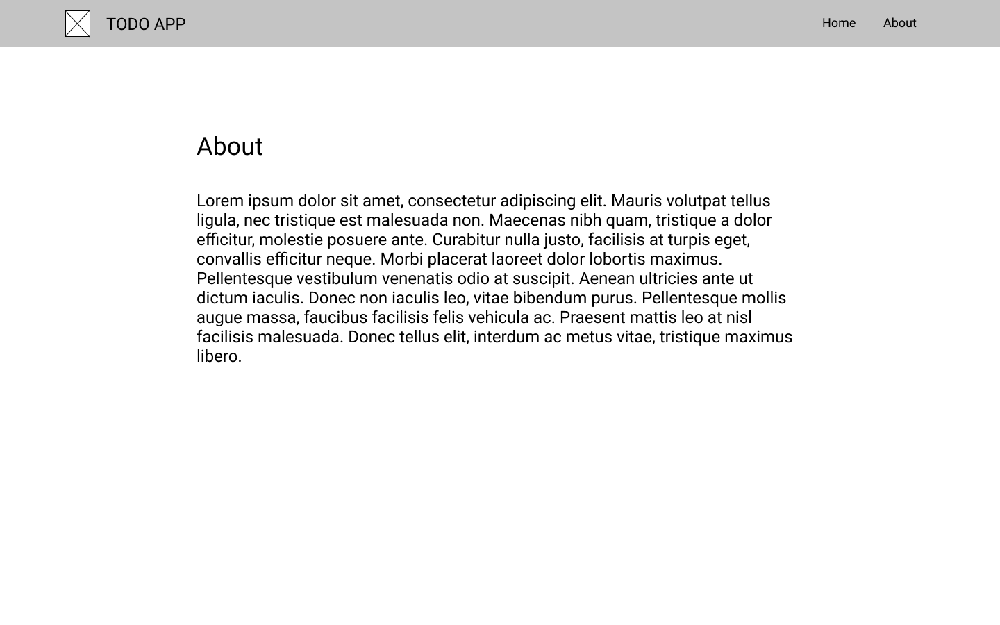
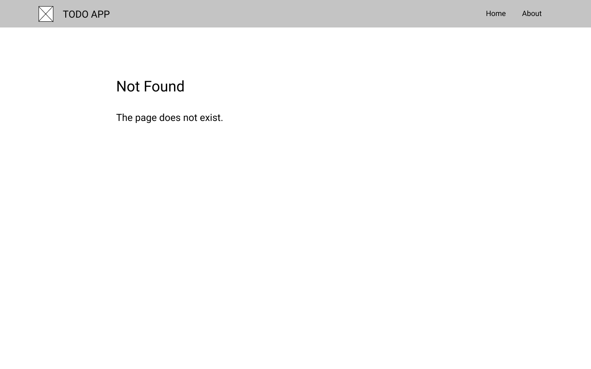

# Create a note-taking web app using Typescript and React

## Part 1: Todo App

The goal of this task is to create a simple note-taking web app inspired by Google Keep. The web app
will communicate with an API to get a list of notes as well as being able to update/delete a note.

It must support routing and handle not found page properly.

### Technical requirements

1. A fake API server should be setup.
    - Recommended: [json-server](https://github.com/typicode/json-server)
2. The web app is setup using [__Typescript__](https://www.typescriptlang.org/),
   [__React__](https://reactjs.org/) and its commonly used library.
    - [Redux](https://redux.js.org/) or [Recoil](https://recoiljs.org/) are preferable for working
      with shared state but you can also use any other lib if it will help you.
    - The code should use Typescript features.
    - React hooks should be used.
3. There should be no CSS library/framework involved. [SCSS](https://sass-lang.com/) can be used.
   [BEM](https://en.bem.info/) methodology is preferred (but you can use any other approaches such
   as CSS Modules or Suit).
4. The solution should be put in a git repository and there must be instructions on:
    - How to run the mock API server
    - How to run the frontend
5. Your code should be formatted in one style.
    - We propose to simply use [ESLint](https://eslint.org/) with some style config and
      [Stylelint](https://www.npmjs.com/package/stylelint) for CSS code style. (but you still can
      just not use them and think about code style by yourself)

### Acceptance Criteria

1. The main functionality includes:
    - Show a list of notes
    - Create a new note
    - Edit a note
    - Delete a note
    - All actions __MUST__ communicate with the API.
2. Other functionality:
    - Support routing (When refreshed, it should stay on the same page)
    - An example of the routes:
        - Home page: `/` or `/home`
        - Create a new note: `/new`
        - Edit a note: `/notes/{id}/edit`
        - About page: `/about`
        - Not found page: `/sth-random`
3. The mockup is provided only as reference. The final result should look like a real web app.

### Bonus

If you implement anything from bonus part, add this information to the README.

1. Documentation
2. Good design and animation
3. Server-side rendering is supported
4. Containing unit tests and/or end-to-end tests
5. Mobile availability
6. Bonus functionality (implement it only if you are sure that your application meets all base
   requirements):
    - Filtering and sorting
    - Note tags
    - If sorting is not selected or not implementing it should be possible to manage notes order
      using drag and drop

## Part 2: BlockChain task

This part is optional, you may skip it.
We want you to demonstrate your ability to work with domain-specific
libraries and understand domain-specific tasks. This part adds
functionality to your note app which use blockchain wallet.

### Technical requirements

1. Use [Ethereum](https://ethereum.org/en/), [Metamask](https://metamask.io/) wallet
   and [ethers](https://www.npmjs.com/package/ethers) library for this task.
    - If you are familiar with other set of technologies you are also free to use them, but in this
      case write information about it in README

### Acceptance Criteria

1. Login with wallet
    - It should be possible to login to the note app using you blockchain account.
    - Notes are independent on different accounts.
2. Transactions to notes
    - Add the second type of notes which will show information about your transaction and some note
      about it.
    - When you choose this type of note you have an opportunity to select receiver, amount of money
      to send and some note about this transaction.
    - After transaction sending it should be possible to see the hash of transaction and its status.

### Bonus

__Note:__ bonus part from the __Part 1__ is more important. Please be sure that your app works
without bugs and satisfy all criteria of the __Part 1__ before moving to the bonus part of
blockchain task. If you implement anything from bonus part, add this information to the README.

1. Logout, account and network should work without reload.
2. After page reload all notes with not finished transactions should wait for status changing.
3. Transaction error handling
    - As a suggestion you can implement toasts with errors and transaction status update (for
      example it can be easily combined with animation task from the Part 1 bonus section).
4. Think about forked chain, failed transactions resend or any other pitfalls of blockchain
   workflow.

## Mockup for Reference

### Home Page

- A note can be deleted via the dropdown.

### Create a note

- Clicking on "Take Note" will expand the container and allow the user to input "title" and "
  description".

### Edit a note

- Clicking on a note will show a modal that allows the user to edit title and description after
  clicking "Update".

### About page

### Not found page

- When accessing a page that does not exist, there should be a proper not found page.

